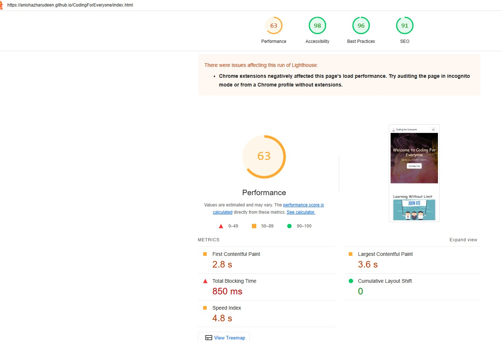
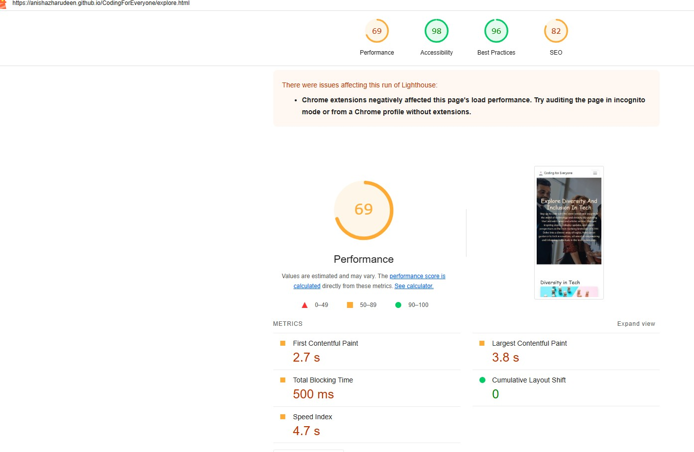
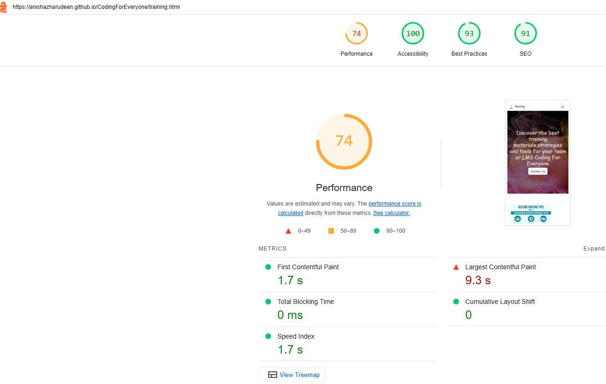
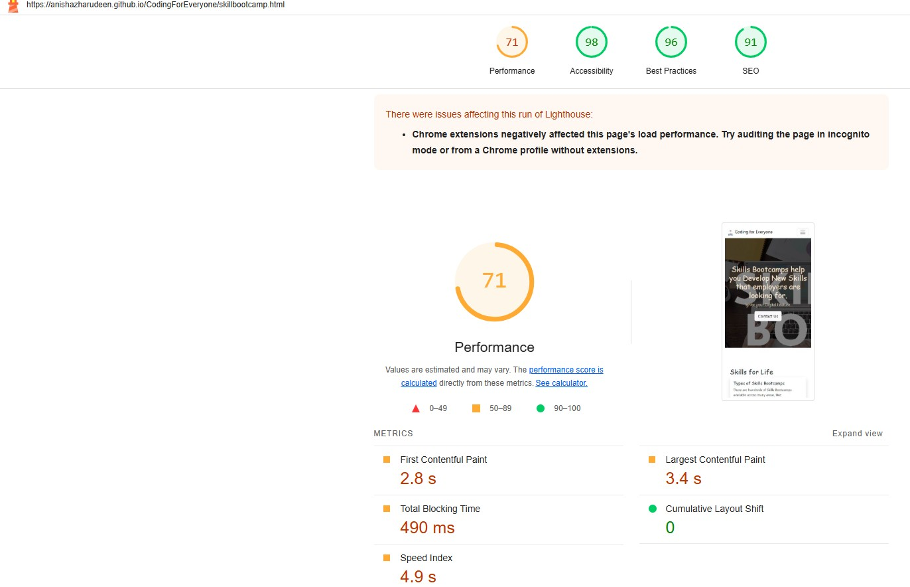

# CodingForEveryone

This Website is developed for Training institute.
Their goal is to offer various skill development training

#  Tech Stack:
   1. Html
   2. Css 
   3. Bootstrap v 5.3
   4. Javascript

#  Pre development ideas:
##  Balsamiq wirefirames:

![Balsamiqwire] (https://drive.google.com/drive/folders/12sPESYVKEZgD_y9QGVxeIgSLoWalNo-4?usp=drive_link)
   
   
    Validation:
    Website is tested and all the pages are vaildated using HTML validator

   | Feature                              | TestcaseName                                                      | TestcaseSteps                                                                        | TestcaseExpectation                                                                                                            | Priority | Result |
| ------------------------------------ | ----------------------------------------------------------------- | ------------------------------------------------------------------------------------ | ------------------------------------------------------------------------------------------------------------------------------ | -------- | ------ |
| Verify Home page                     | Verify if the page is responsive                                  | Verify if the page is responsive                                                     | Check the website in various device like mobile,desktop,ipad                                                                   | P0       | PASS   |
| Verify Home page                     | Check if the hero image uploaded is as expected                   | Check if the hero image uploaded is as expected                                      | Hero image must be as expected and the behaviour is consistent across all the device.                                          | P0       | Pass   |
| Verify Home page                     | Check the contact us form button is working as expected           | Click contact us button takes us to "Contact form"                                   | User should be able to backup while creating new wallet.                                                                       | P0       | PASS   |
| Verify Home page                     | Validate the page using html file validator                       | Use the validator to check the errors in the page.                                   | Should not return any error                                                                                                    | P2       | PASS   |
| Verify Home page                     | Check the Footer is designed as per the requirement               | Go to Footer and check the design is as expected.                                    | Footer is designed as expected                                                                                                 | P1       | PASS   |
| Verify Home page                     | Check the performance of the page using Lighthouse developer tool | Go to the PAge, Click chrome developer tools, select lighthouse and run the analysis | Page should achieve certain metric as expected.                                                                                | P0       | PASS   |
| Verify About page                    | Repeate the testcase from 1 to 6 in About page                    | Repeate the testcase from 1 to 6 in About page                                       | Once the backup is enabled , the status of backup must be displayed as Active for the appropriate method.                      | P1       | PASS   |
| Verify Training page                 | Repeate the testcase from 1 to 6 in Training page                 | Repeate the testcase from 1 to 6 in Training page                                    | User should be able to backup wallet in their googe drive                                                                      | P1       | PASS   |
| Verify Skill Bootcamp Page           | Repeate the testcase from 1 to 6 in SkillBootscamppage            | Repeate the testcase from 1 to 6 in SkillBootscamppage                               | After the Wallet is created,Passcode setup should be essential and successful                                                  | P0       | PASS   |
| Verify Diversity-Explore All Page    | Repeate the testcase from 1 to 6 in Explore all Diversity page    | Repeate the testcase from 1 to 6 in Explore all Diversity page                       | Once the backup is enabled , the status of backup must be displayed as Active for the appropriate method.                      | P2       | PASS   |
| Verify Diversity-Age Page            | Repeate the testcase from 1 to 6 in Age page                      | Repeate the testcase from 1 to 6 in Age page                                         | User should be able to add their Existing Wallet                                                                               | P0       | PASS   |
| Verify Diversity-Race Page           | Repeate the testcase from 1 to 6 in Race page                     | Repeate the testcase from 1 to 6 in Race page                                        | User should be able to add their Existing Wallet using secrete Phase or backup from google drive.                           | P1       | PASS   |
| Verify Diversity-Gender Page         | Repeate the testcase from 1 to 6 in Gender page                   | Repeate the testcase from 1 to 6 in Gender page                                      | User should be able to add their Existing Wallet using secrete Phase                                                        | P0       | PASS   |
| Verify Diversity-Neurodiversity Page | Repeate the testcase from 1 to 6 in Neurodiversity page           | Repeate the testcase from 1 to 6 in Neurodiversity page                              | User should not be able to add their Existing Wallet using wrong secrete Phase . Proper error message must be displayed. | P1       | PASS   |
| Verify Contact us form               | Enter details to fill in Contact Form                             | Enter all the valuse and click the subit button                                      | Form should be submitted successfully                                                                                          | P1       | PASS   |
| Verify CSS file                      | Check CSS file                                                    | Evaluate css file using css file validator                                           | Css file must pass with zero errors                                                                                            | P0       | PASS   |

Performance Scores:

*** Score genrated by Lighthouse ***

Credits: 

***Section provides information about the supporting documents***

Image credits:

Content Credits:

Shecancode

Skill bootcamps for united kingdom
